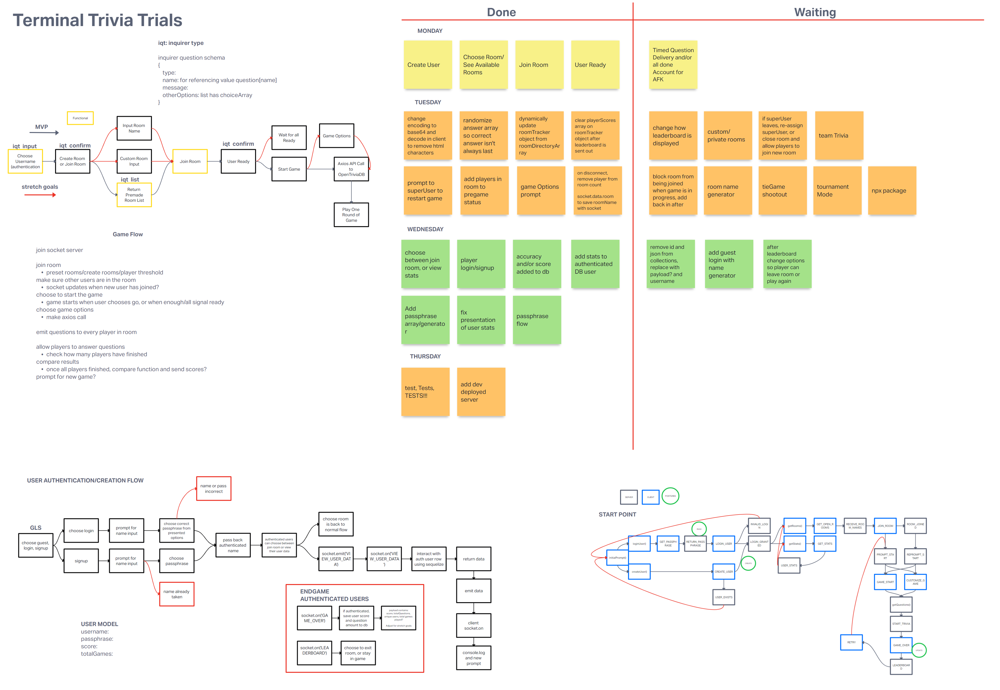

# Terminal Trivia Trials

 Authors: Joe Davitt, Brandon Perard, Arienne Frey, Jonathan Staib
 
 ## Overview
 
  Multiplayer Trivia is a game of trivia that utilizes socket.io and an open trivia database. It allows us to make a project without a Front-End that allows users to interact with eachother in real time. You will go through a level of authorization and your user data will be stored within our database.

## Process & Documentation

This is our Invision board we used during our initial planning/wireframing, for our daily tasks Kanban board, and for developing and wireframing new features. It also includes the flowchart for the interactions of our entire app.

